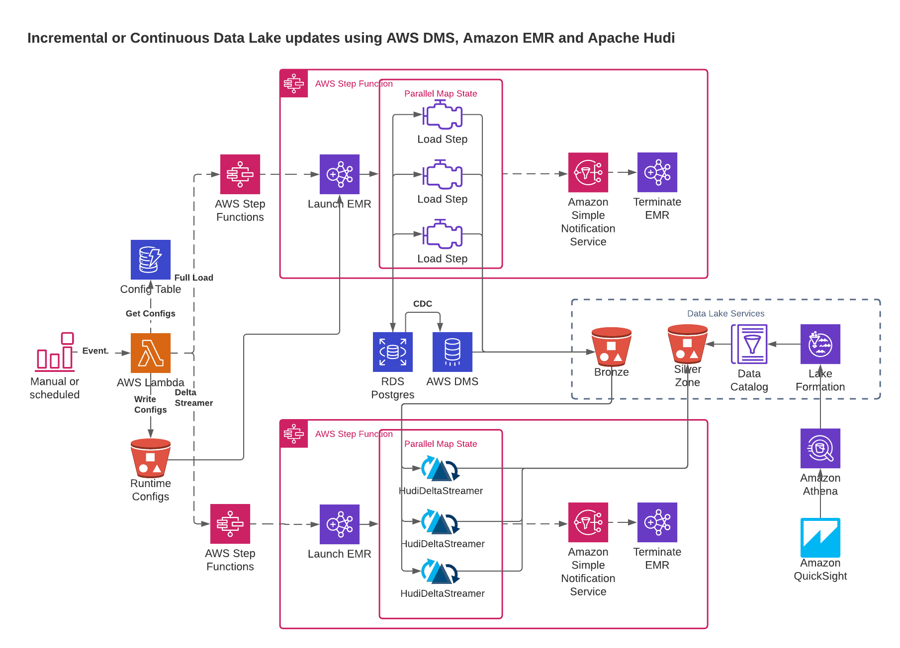

# AWS Data Analytics Black Belt Capstone project

## Batch/incremental ingestion from RDBMS into Modern data lake architecture    

### Summary    

This project is a modern approach to keeping a data lake up to date from an operational source.   
The source for this project is an Amazon RDS Postgres instance, but additional sources could be easily integrated.    
Technology choices include:

- AWS Step Functions
- DMS (for CDC data)
- Amazon EMR with Apache Hudi
- S3
- AWS Glue Data Catalog
- LakeFormation
- Amazon Athena
- Amazon QuickSight
- DynamoDB (for pipeline configuration data)

#### Pipeline Diagram    

### Deployment prerequisites   

The following prerequisites and information are needed before deploying this solution

- Local Environment configurations
  - AWS CLI
    - Admin Credentials configured (Fine-grained permissions required to deploy this have not been established)
  - AWS SAM CLI
  - Python 3.9
- In your AWS Account
  - [LakeFormation Admin permissions configured](https://catalog.us-east-1.prod.workshops.aws/v2/workshops/78572df7-d2ee-4f78-b698-7cafdb55135d/en-US/lakeformation-basics/datalake-administrator)
  - An Existing Postgres RDS Database
    - Obtain the connection information
    - Obtain a list of schemas and tables
    - This database instance should be [configured for replication](https://docs.aws.amazon.com/dms/latest/userguide/CHAP_Source.PostgreSQL.html)
  - VPC Configurations [OPTIONAL]
    - Depending on requirements, this solution can be deployed in existing subnets or it can create all networking components
    - If you are bringing your own, then obtain two private subnet id's from the existing VPC to deploy this solution in
  - Determine the region you would like to install
  - Determine if you would like to create the AWS DMS infrastructure
  - Determine if you would like to create the consumption layer (Quicksight, Athena workgroup)
  - Determine if you would like to configure DR. This solution has only been tested to work with us-east-1 and us-west-2 regions.
    - Some refactoring may be needed if DR needs to be in another region (for example, us-west-1 would fail because us-west-1a doesn't exist )
  - Determine if the [DMS VPC](https://console.aws.amazon.com/iam/home#/roles/dms-vpc-role) service role already exists in your account
      - If not, this solution will create it 
- An email address for operational/runtime notifications
  - Job state information will be sent to the operator email address

### Project structure

This project uses [template.yaml](template.yaml) as the parent stack.  
This is the only stack you will name, everything else will be generated based on this and child stack names.   
Child stacks can be found under the [templates](templates/) directory. Please find [cloudformation.png](images/cloudformation.png) for a diagram of stack contents.

#### Navigate to LakeFormation in the Region you will deploy this stack, add yourself or the cloudformation assume role as admin

https://us-west-2.console.aws.amazon.com/lakeformation/home?region=us-west-2#administrative-roles-and-tasks

